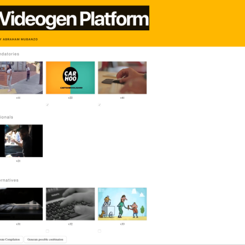

# IDM - DOCUMENTATION

### JAVA SERVER

1. The server run on `localhost:80808/`, all the files will be server in the current working directory and the program will produce files in the `Pexels` reporsitory. 

2. The current example1.videogen file can be replaced with any valid videogen file, but the filename has to be the same. The program will still work accordingly.

3. All media (.mkv format) files will have to be stored in the created directory.

4. The program uses ffmpeg, my local environement uses a unix based system and the path to ffmpeg is `/usr/local/bin/ffmpeg`
 
 Path to output directory : `$dir/VideoGenToolSuite/Pexels/`
 

#### API ROUTES
BasePath = `localhost:8080/`

| Route |  Method  | Params | Body |
|:------------- |:---------------:| :-------------:|-------------:
| allMedias | GET |NONE|NONE|
| variant/possibilities/data/|GET|NONE|NONE
| variant/duration/| GET | NONE| NONE|
| compile/gif/| GET|gifname: string| NONE|
| compile/autogenerate/|GET|autogen: boolean, filename:string| {"uri1, uri2, etc."} |

### FRONT-END

Step 1: Clone repo on local environment and in a terminal locate the project and then `npm install`
Step 2: start the `Java Server`
Step 3: Start the `Front End` like so `npm start`

The front end will be server on `localhost:3223`

Due to limited time, the features i wanted to include on the front side weren't implemented.

Here are some of them:

* Allow a user to visualize the generate video inside a video plugin player https://github.com/redxtech/vue-plyr
* Allow a user to visualize data charts of possible variants and choose which one he (she) wants to generate.
* Make input button to allow a user to choose a name for the compilation and gif

I will improve my work in the future.

